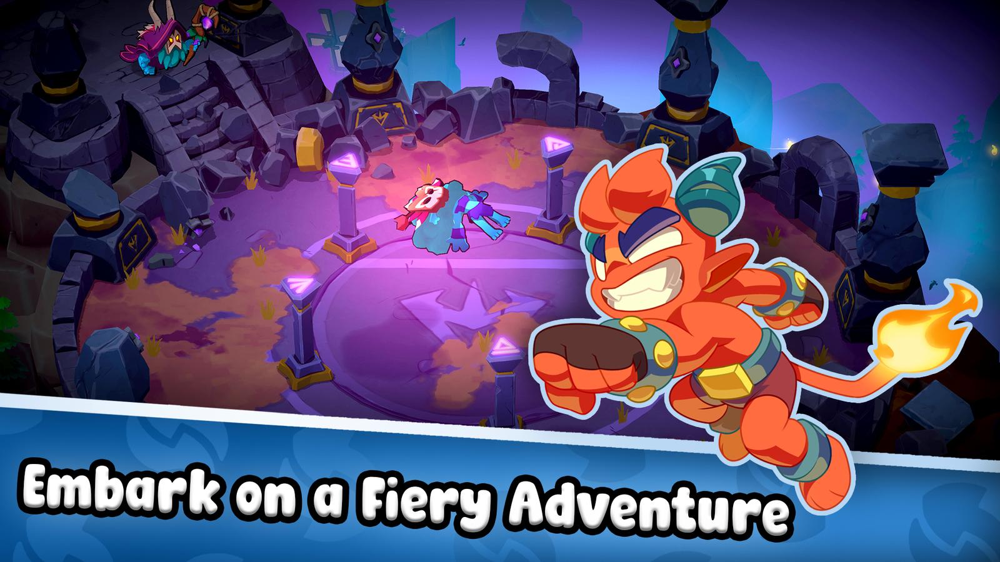
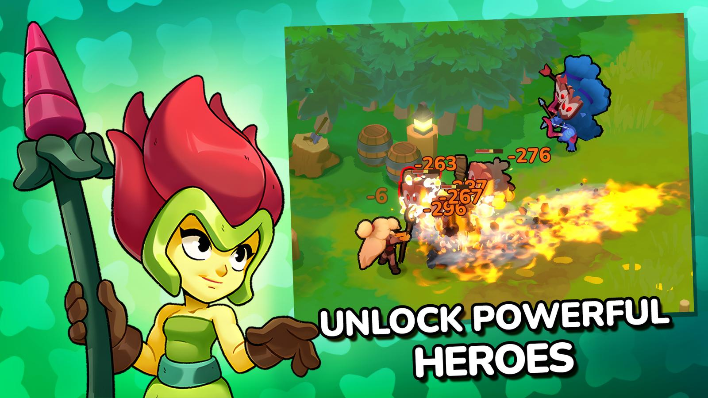

<h1 align="center">🕹️ devlog.</h1>
<p align="center"><strong>Adiel Magenheim — game dev, mostly mobile, increasingly AI.</strong></p>
<p align="center">
  <a href="https://adielmag.github.io/"><strong>▶ View the live site →</strong></a>
</p>

---

A personal game-development blog. Six years deep in mobile game dev, now building
solo with AI — client, server, physics, all of it. The site showcases shipped
games, a work-in-progress flagship (**ClashUp**), and short devlog articles.

Built as a **static site** — plain HTML/CSS/JS, **zero dependencies, no build
step** — and hosted free on **GitHub Pages**. Articles are Markdown files rendered
in the browser.

## ✨ Highlights

- **Animated hero** — floating pixel props, parallax glow, a mouse-following smiley.
- **Projects** — a "currently building" spotlight plus a grid of shipped games.
- **Expandable project cards** — click any project for a modal with a **scrollable
  screenshot gallery**, extra data (publisher, genre, rating, installs), and links
  to the App Store / Google Play (or archive mirrors for delisted titles).
- **Real writable articles** — drop in a Markdown file, flip it to `published`.
- **Responsive + themed** — clamped type, auto-fit grids, no horizontal scroll.

## 🎮 Projects featured

| Game | Publisher | Status | Links |
|---|---|---|---|
|  **Pokerface** | Comunix | ✅ Live · ★4.7 · 5M+ | [App&nbsp;Store](https://apps.apple.com/us/app/poker-face-texas-holdem-live/id1364570884) · [Google&nbsp;Play](https://play.google.com/store/apps/details?id=com.comunix.pokerface) |
|  **Swap Heroes: Eternal Legends** | Glaive Games | ✅ Live · active dev | [App&nbsp;Store](https://apps.apple.com/us/app/swap-heroes-eternal-legends/id6755378713) · [Google&nbsp;Play](https://play.google.com/store/apps/details?id=com.glaivegames.swapheroes) |
|  **Royal Bingo** | Comunix | ⚠ Delisted | archived on [APKPure](https://apkpure.com/royal-bingo-live-bingo-game/com.communix.royalbingo) · [Softonic](https://royal-bingo-live-bingo-game.en.softonic.com/android) |
|  **Solaria: Dawn of Heroes** | Glaive Games | ⚠ Delisted | archived on [APKPure](https://apkpure.com/solaria-dawn-of-heroes/com.glaivegames.solaria) · [Softonic](https://solaria-dawn-of-heroes.en.softonic.com/android) |
| 🔒 **ClashUp** | Adiel (solo) | 🔧 In development | private repo |

### Screens

<p>
  
  
  
  
</p>

## 🗂 Structure

```
index.html                 Landing page (hero, projects, articles)
article.html               Article template — reads ?slug=, renders a post
posts/<slug>.html          Generated static page per post (real share metadata)
feed.xml / sitemap.xml     Generated RSS feed + sitemap
tools/build-posts.mjs      Generator for posts/, feed.xml, sitemap.xml
assets/
  css/styles.css           Theme, animations, component + modal styles
  js/articles.js           Article manifest
  js/projects.js           Project data (facts, screenshots, store links)
  js/markdown.js           Tiny Markdown -> HTML renderer (no dependencies)
  js/main.js               Landing interactions, article cards, project modal
  js/article.js            Article-page rendering
  img/                     App icons, studio logos, screenshots, og-card share image
content/articles/*.md      One Markdown file per post
.nojekyll                  Serve files as-is on GitHub Pages
```

## 🚀 Run locally

The article page uses `fetch()` to load Markdown, which browsers block on
`file://` — so serve it over a local web server:

```bash
python -m http.server 8000
# then open http://localhost:8000/
```

(No Python? `npx serve` works too.)

## ✍️ Add an article

1. Create `content/articles/<slug>.md` — Markdown, starting with a `# Title`.
2. Add an entry to `assets/js/articles.js` with a matching `slug` (set both
   `date` and `dateISO`).
3. Set `status: 'published'` when it's ready (drafts show a placeholder).
4. Run `node tools/build-posts.mjs` — regenerates the static pages in `posts/`
   (these carry the Open Graph tags that make shared links unfurl properly),
   plus `feed.xml` and `sitemap.xml`. Commit the output.

## 🕹 Add or edit a project

Everything about a project — description, facts, screenshots, and store links —
lives in `assets/js/projects.js`. Add screenshots to `assets/img/shots/` and
reference them in the project's `shots` array; the modal builds the gallery
automatically.

## 🌐 Deploy

Hosted on GitHub Pages from the `main` branch root at
**https://adielmag.github.io/**. Push to `main` and Pages redeploys
automatically — the Markdown `fetch()` works in production because Pages serves
over HTTPS.

---

<p align="center"><sub>Store data & screenshots sourced from the App Store, Google Play, and third-party archives (APKPure, Softonic) for delisted titles.</sub></p>
